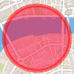
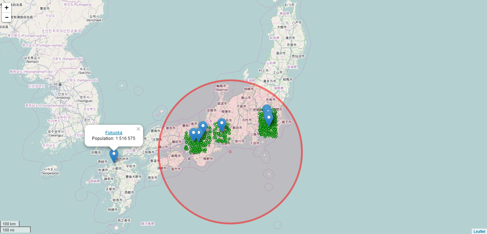

# Japan Tsunami alert (Cassandra version)
The project aims to build a tsunami warning system with SMS for japanese people following an earthquake. People in threatened areas have to be warned as soon as possible.

## Tools
- [Cassandra](http://cassandra.apache.org/) : Database column oriented with high scalability and high availability without compromising performance.
- [Leaflet](http://leafletjs.com/) : Javascript library to build interactive maps.
- [Flask](http://flask.pocoo.org/) ::Tiny python framework to build web applications.  

## Cassandra design
<table>
<thead>
<tr>
	<th>Column</th>
	<th>Type</th>
	<th>Description</th>
</tr>
</thead>
<tbody>
<tr>
	<td> timestamp </td>
	<td> timestamp </td>
	<td>People's geolocalisation date</td>
</tr>
<tr>
	<td> latitude </td>
	<td> float </td>
	<td>Antenna's latitude</td>
</tr>
<tr>
	<td> longitude </td>
	<td> float </td>
	<td>Antenna's longitude</td>
</tr>
<tr>
	<td> codegsm </td>
	<td> text </td>
	<td>Gsm of the antenna</td>
</tr>
<tr>
	<td> phone </td>
	<td> text </td>
	<td>People's phone number</td>
</tr>
</tbody>
</table>  

## Setup Cassandra
First install Cassandra, for Debian based: http://www.datastax.com/documentation/cassandra/2.0/cassandra/install/installDeb_t.html

Create a key space:
```
$cd install_folder
$desc kespaces;
$cqlsh
```
Follow this doc: http://www.datastax.com/documentation/cql/3.0/cql/cql_reference/create_keyspace_r.html
```
cqlsh> CREATE KEYSPACE japan_tsunami
... WITH REPLICATION = {'class' : 'SimpleStrategy', 'replication_factor' : 5};


```

## Visualization  
<table>
<thead>
<tr>
	<th>Icon</th>
	<th>Description</th>
</tr>
</thead>
<tbody>
<tr>
	<td> <center><center> </td>
	<td>One person geolocalized into tsunami radius</td>
</tr>
<tr>
	<td> <center><center> </td>
	<td>Tsunami radius</td>
</tr>
<tr>
	<td> <center><center> </td>
	<td>One city</td>
</tr>
</tbody>
</table>
  
